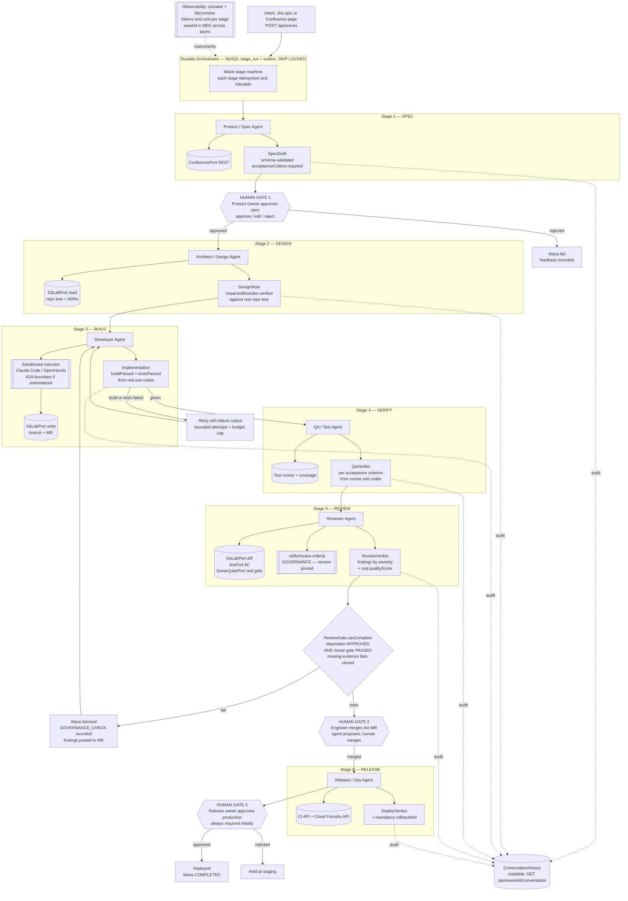

# SDLC Agent Plan — From Two Prototypes to One Agentic SDLC Platform

> **Scope.** A build plan for a single production-viable system in which a dedicated, specialized agent owns each SDLC domain (spec → design → code → test → review → deploy), grounded in (1) what the two projects in this repository actually contain today and (2) sourced state-of-the-art research as of **July 2026**.
>
> **Method.** Section 1 is grounded entirely in the source tree on disk — every claim names a real file, class, or line. Sections 2–6 cite sources inline; where evidence is thin, contested, or comes from low-quality secondary reporting, it is flagged explicitly.
>
> **Analysis date:** 2026-07-25.

---

## 1. Current State

### 1.1 What is actually in this repository

Two **independent, unrelated** Spring Boot projects. They share no code, no parent POM, no group ID, and never reference each other:

| | `team/` | `reviewer-agent/` |
|---|---|---|
| Group / artifact | `com.agile:team` | `com.orange.ai:reviewer-agent` |
| Spring Boot | **4.1.0** | **3.5.8** |
| Spring AI | **2.0.0** | **1.1.0** |
| Java | 17 | 21 |
| Model configured | `claude-sonnet-5` | `claude-opus-4-20250514` |
| Persistence | MySQL + Flyway (`V1.0.0`–`V1.2.0`) | None |
| Tests | 7 test classes (domain-only) | 1 (`ReviewerAgentApplicationTests`, empty `contextLoads`) |
| Version control | **Not a git repository** | git, 1 commit `e7f41e3` |
| SDLC stages targeted | PO / DEV / REVIEWER / QA | Code review only |

They are best understood as **two attempts at the same goal from opposite ends**: `team` is a top-down orchestration skeleton with no working integrations; `reviewer-agent` is a bottom-up working integration with no orchestration.

### 1.2 Project A — `team`: an orchestration skeleton that is switched off

`team` is designed as a five-stage event relay that turns a Confluence page into a spec → code → review → QA → completed **Wave** (its unit of work, analogous to a sprint increment).

**What actually executes today is one agent, and the wave never leaves `PLANNING`.**

A `POST /api/waves` call (`WaveController.startWave`) runs `StartWaveUseCase` → `Orchestrator.startWave()` (`Orchestrator.java:42-62`), which persists a `Wave`, creates a `ConversationHistory`, and publishes an in-JVM `AgentTaskAssignedEvent`. `PoAgentHandler.handleTaskAssigned()` then searches Confluence, calls Claude, stores the raw response as a `Specification`, and **deliberately stops**:

- `PoAgentHandler.java:141-145` — the `SpecificationReadyEvent` publish is commented out.
- `PoAgentHandler.java:122-129` — Jira issue creation is commented out.
- `PoAgentHandler.java:147` — logs *"Pipeline stopped here — awaiting manual validation of Jira ticket output."*

Everything downstream is a commented-out body: `DevAgentHandler.java:53-110`, `ReviewerAgentHandler.java:48-94`, `QaAgentHandler.java:42-97`. In `Orchestrator.java:67-69` and `:85-87` even the `@Async`/`@EventListener` annotations are commented, so those listeners are not registered at all. `Wave.startExecution/moveToReview/complete` (`Wave.java:59-84`) are exercised only by `WaveTest`, never by the running system.

**The disabled code would not have worked either.** This is the more important finding — re-enabling it is not a fix:

- **The tool adapters do not call any API.** `GitLabAdapter`, `JiraAdapter`, and `SonarQubeAdapter` (`infrastructure/adapter/mcp/`) implement domain ports by sending a natural-language instruction to a `ChatClient` and returning the free-text reply as the result. `GitLabAdapter.java:19-26` literally prompts *"Create a GitLab branch 'x' from 'main' in project 'y'"* and returns the answer. Meanwhile `application.yaml:44` sets `spring.ai.mcp.client.enabled: false`, so the model has no tools and can only fabricate a plausible reply.
- **Control flow is decided by substring matching on LLM prose.** Approval is `aiResponse.toLowerCase().contains("approved")` (`ReviewerAgentHandler.java:69-72`); QA pass is `contains("passed") || contains("accepted")` (`QaAgentHandler.java:81-82`). The sentence *"changes are needed before this can be approved"* is scored as APPROVED.
- **The governance gate is fed fabricated inputs.** `ReviewGate.canComplete()` (`ReviewGate.java:12-17`) correctly requires `reviewDisposition.isApproved() && qualityScore.passed()` and is properly unit-tested. But `ReviewerAgentHandler.java:77` hardcodes `CodeQualityScore.passing(80)` with the comment *"since we don't want to block on unavailable SonarQube."* The invariant is sound; the inputs are theatre.
- **PO output is never validated.** The prompt demands strict JSON with `summary`/`description`/`acceptanceCriteria` (`PoAgentHandler.java:161-170`), but `PoAgentHandler.java:111-117` stores `llmResponse` verbatim and passes `List.of()` for acceptance criteria — discarding exactly the structured criteria the QA agent is supposed to check.
- **The skills system is built but never invoked.** `SkillRegistryAdapter` correctly parses `skills/*/SKILL.md` frontmatter, and `SpringAiAgentBridge.resolveSkillContext()` (`:67-98`) assembles the skill context — but it is `private` and **called from nowhere**. `buildSystemPrompt()` (`:100-115`) returns four hardcoded strings. Skills are inert at runtime.
- **`ConversationHistory` is write-only.** Handlers call `record(...)`; nothing calls `getMessages()` at runtime, no controller exposes it, and no downstream prompt reads it. There is no agent memory — each LLM call starts cold.
- **The "audit log" is in-memory.** `SkillGovernanceUseCase.java:33` stores audit entries in a `Collections.synchronizedList(new ArrayList<>())` — lost on every restart, invisible to other instances.
- **Orchestration is not durable.** Handoffs are `ApplicationEventPublisher` + `@Async` in one JVM. No outbox, no queue, no retry, no idempotency key. A restart mid-wave loses the run; a second instance sees nothing.
- **A live Anthropic API key is committed** at `application.yaml:37` as the default of `${ANTHROPIC_API_KEY:sk-ant-api03-…}`, alongside DB credentials `root/root` (`:23-24`). `team` is not yet a git repo, so this is not yet in history — that is a narrow, closing window.

**What is genuinely good in `team`** — and worth keeping:

- `ConfluenceRestClient` (`infrastructure/adapter/confluence/`) is a real, clean REST adapter with `@Primary` override of the MCP one, CQL search, and Bearer auth. It is the pattern every other adapter should copy.
- The domain layer is honest DDD with no framework imports: `Wave` (with an enforced state machine and `authorizedBy` audit on every transition), `ReviewGate`, `Specification`, `Task`, `ConversationHistory`, and the `port/` interfaces.
- The **governance concept** — `ReviewGate` + `governance: true` skills + `.github/CODEOWNERS` routing `/skills/review-criteria/` to `@team-leads @quality-guild` + `SKILLS_DECISION.md`'s explicit adopt/reject rationale — is the most differentiated idea in either project. Nothing in the commercial landscape ships this as a first-class, auditable artifact.
- `skills/review-criteria/SKILL.md` is a real severity taxonomy and quality checklist, not filler.
- Persistence, mappers, and Flyway migrations are complete and coherent.

### 1.3 Project B — `reviewer-agent`: a working review agent with real integrations

`reviewer-agent` does one thing and, unlike `team`, actually does it. `ReviewOrchestrator.performCompleteReview()` (`:84-119`) runs a deterministic seven-step RAG pipeline:

1. `GitLabTools.fetchMergeRequestInfo(mrUri)` → real `RestClient` call to `/api/v4/projects/{id}/merge_requests/{iid}` and `/changes`.
2. Regex-extract the Jira key from the MR title/description (`GitLabProperties.GitLabClient.extractJiraTicket`, pattern `([A-Z]+-\d+)`).
3. `JiraTools.getIssueDetails()` → real Jira REST v3 call, with heuristic acceptance-criteria extraction (`JiraClient.java:57-85`).
4. `SonarQubeTools.getQualityGateStatus()` → real `/api/qualitygates/project_status`.
5. `SonarQubeTools.getIssuesForBranch()` → real `/api/issues/search`.
6. `AiCodeReviewService.performReview(context)` → a **templated** prompt (`REVIEW_PROMPT_TEMPLATE`, `:24-73`) bound to a typed record via `.entity(ReviewComment.class)` (`:91-94`).
7. `formatReviewAsMarkdown()` → posts a structured comment back to the MR.

Plus a webhook entry point (`CodeReviewController.handleGitLabWebhook`) so review can be triggered by GitLab, not just by hand.

**This is materially more mature than `team`'s reviewer** on every axis that matters: real API calls, a versioned prompt template, structured output binding instead of substring matching, and a real trigger.

**But it has three defects that block production use:**

1. **The GitLab and webhook DTOs cannot deserialize.** There is no `@JsonProperty` and no `spring.jackson.property-naming-strategy` anywhere in the project (verified by grep — zero matches). GitLab returns snake_case. So `GitLabMergeRequest.sourceBranch`/`targetBranch` (`GitLabProperties.java:108-116`) and `Change.oldPath`/`newPath` are always **null**, and `GitLabWebhookPayload.objectKind`/`objectAttributes`/`pathWithNamespace` (`CodeReviewController.java:53-60`) are always null — meaning `CodeReviewController.java:40` dereferences `payload.objectAttributes().action()` and throws **NullPointerException on every real GitLab webhook**. The webhook path has never worked.
2. **A live Anthropic API key and a live Jira token are committed to git history.** `application.yaml:6` holds a full `sk-ant-api03-…` literal and `:19` a Jira API token as a default. `git log -S "sk-ant-api03"` confirms both are in commit `e7f41e3`. No remote is configured yet — so this is recoverable, but only until someone pushes.
3. **The stack is end-of-life.** Spring Boot 3.5 reached EOL on **30 June 2026** ([Spring AI 2.0 GA announcement](https://spring.io/blog/2026/06/12/spring-ai-2-0-0-GA-available-now/)), 25 days before this analysis. `reviewer-agent` cannot receive security patches on its current parent POM.

Minor but telling: `README_ARCHITECTURE.md` describes an `infrastructure/gitlab/GitLabClient.java` that does not exist — the client is a nested `static class` inside the `GitLabProperties` **record** (`GitLabProperties.java:21-127`). Three files under `domain/sonarqube/` (`SonarQubeService.java`, `QualityGateStatus.java`, `IssuesSummary.java`) are **0 bytes**; the real SonarQube types live misfiled in `domain/jira/`. The docs describe an aspirational structure, not the built one — the same pattern as `team`'s `CLAUDE.md`.

### 1.4 The shared objective, stated from the evidence

Reading only the code, both projects are converging on the same thesis:

> **Treat the existing enterprise SDLC toolchain — Confluence for requirements, Jira for work items, GitLab for code and merge requests, SonarQube for quality — as the system of record, and insert LLM agents as the actors that read from and write to it, with an explicit, auditable quality gate deciding whether work advances.**

Both encode the same three convictions: (a) agents must be grounded in *real* organizational artifacts, not free-form chat; (b) each SDLC role gets its own prompt, tools, and output contract; (c) something deterministic — `ReviewGate`, the SonarQube quality gate — must hold veto power over an LLM's opinion. That last conviction is the strongest shared idea and the one worth building the platform around.

The target codebase is not hypothetical: `DevAgentHandler.java:71-73` hardcodes the project `epe-rating-ftth-passive`, and `PoAgentHandler.java:33` hardcodes Confluence space `EPE`. The first customer of this agent team is a Cloud Foundry–deployed Spring Boot application.

### 1.5 Overlap, redundancy, and gaps

**Direct overlap — exactly one area, and it is the most valuable one.** Both implement a code reviewer:

| Capability | `team` `ReviewerAgentHandler` | `reviewer-agent` |
|---|---|---|
| Fetch MR + diff | prompt-and-pray via `GitLabAdapter` | **real REST client** |
| Jira context | none | **real, with AC extraction** |
| SonarQube | hardcoded `passing(80)` | **real quality gate + issues** |
| Prompt | inline `String.format` | **versioned template** |
| Output | substring match on prose | **typed record via `.entity()`** |
| Post back to MR | not implemented | **formatted markdown comment** |
| Trigger | in-JVM event | **REST + GitLab webhook** |
| Governance gate | `ReviewGate` (real, starved of inputs) | none |
| Severity taxonomy | `skills/review-criteria/SKILL.md` | inline in prompt |

Neither is a superset. `reviewer-agent` has the working machinery; `team` has the governance semantics. **Merging them yields a genuinely production-grade reviewer** — this is the single highest-leverage move available.

**Redundant / to discard:**
- `team`'s `infrastructure/adapter/mcp/{GitLabAdapter,JiraAdapter,SonarQubeAdapter}.java` — LLM-prose-as-API-call. Delete; replace with ported REST clients.
- `reviewer-agent`'s three 0-byte `domain/sonarqube/*.java` files, and the misfiled SonarQube types under `domain/jira/`.
- `reviewer-agent`'s `ReviewOrchestrator.gatherMergeRequestContext()` — routes a deterministic fetch through an LLM for no benefit; `gatherMergeRequestContextDirect()` already does it correctly.
- Duplicated `MergeRequestInfo`/`QualityGateStatus`/`IssuesSummary` value objects across both projects.

**Missing entirely, relative to a full SDLC-covering system:**

| SDLC domain | Status across both projects |
|---|---|
| Product / spec | Partial — `PoAgentHandler` produces unvalidated free text; no approval mechanism |
| **Architecture / design** | **Absent.** No agent, no artifact, no ADR concept anywhere |
| Development (writing code) | **Absent in substance.** No agent in either project has ever edited a file. `team`'s DEV agent asks an LLM to create a branch conversationally; there is no workspace, no sandbox, no build, no commit |
| Testing / QA | Stub only — `QaAgentHandler` asks an LLM whether things "passed". No test generation, no test execution, no coverage |
| Code review | **Present and near-working** in `reviewer-agent` |
| Deployment / ops | **Absent.** No CI, no Dockerfile for either app, no Cloud Foundry integration, no release gate |

Cross-cutting absences: no durable orchestration, no observability (no actuator, no Micrometer, no token/cost accounting, no correlation ID across the `@Async` boundary), no human-in-the-loop endpoint, no evaluation harness for any agent, no CI pipeline, no secrets hygiene.

**The honest headline: the gap is not orchestration. It is that nothing in this repository can write, build, or ship code.** Everything upstream and downstream of that is scaffolding around an empty center.

### 1.6 Reusable inventory

| Keep | Where | Why |
|---|---|---|
| `Wave` aggregate + state machine + `StateTransition` audit | `team/domain/wave/` | Correct, tested, and the natural home for durable stage tracking |
| `ReviewGate` | `team/domain/review/` | The differentiated governance primitive |
| Skills registry + `SKILLS_DECISION.md` + `CODEOWNERS` | `team/skills/`, `team/.github/` | Auditable, versioned governance knowledge (see §2.5 for the caveat on how to *use* it) |
| `ConfluenceRestClient`, `HtmlToTextConverter` | `team/infrastructure/adapter/confluence/` | Working integration; the reference adapter pattern |
| JPA entities, mappers, Flyway migrations | `team/infrastructure/persistence/`, `resources/db/migration/` | Complete and coherent |
| DDD/hexagonal package layout | `team/` | Sound; the seam that makes agent swapping possible |
| GitLab / Jira / SonarQube REST clients | `reviewer-agent/infrastructure/` | The only real toolchain integrations that exist (fix the naming bug) |
| `AiCodeReviewService` prompt template + `ReviewComment` record + `.entity()` binding | `reviewer-agent/application/review/` | The correct structured-output pattern |
| `formatReviewAsMarkdown` + webhook trigger | `reviewer-agent/` | Working delivery and trigger mechanism |

---

## 2. State of the Art Summary (2026)

### 2.1 How the field structures "an agent per SDLC role"

The industry has converged on **orchestrator + specialized workers**, not peer-to-peer agent swarms. Forrester frames 2026 as the shift ["from code assistants to orchestrated SDLC agents"](https://www.forrester.com/blogs/agentic-software-development-takes-the-lead-from-code-assistants-to-orchestrated-sdlc-agents/), where an orchestrator routes work, preserves shared context, sequences tasks, reconciles conflicting outputs, and escalates uncertainty. Practitioner reports describe role-based rosters with validation gates at every phase — one [published account describes a 16-agent spec-driven pipeline](https://medium.com/@brettluelling/how-we-built-a-16-agent-sdlc-that-ships-features-end-to-end-2a3621fc9e64) with CEO-review, design-consult, QA-lead, security-officer, and release-engineer roles. *(Flag: that is a single self-reported case study, not independently validated; treat the role decomposition as illustrative, the outcomes as unverified.)*

The most consequential structural trend is **spec-driven development (SDD)**: the specification, not the prompt, is the durable artifact, and code is a regenerable output. [GitHub Spec Kit](https://www.augmentcode.com/tools/best-spec-driven-development-tools) — an MIT-licensed CLI implementing a `constitution → specify → plan → tasks → implement` workflow as plain markdown in the repo, supporting ~30 agents — and [AWS Kiro](https://medium.com/system-design-mastery-series/aws-kiro-vs-github-spec-kit-the-honest-comparison-every-developer-needs-right-now-8284412d7668), a spec-first agentic IDE using EARS requirements syntax, are the category leaders. *(Flag: reported adoption figures for Spec Kit and productivity claims for Kiro come from vendor blogs and SEO-heavy aggregators; directionally credible, numerically unreliable.)*

This matters directly here: `team`'s `Specification` aggregate and `skills/specification-template/SKILL.md` are already an SDD design that predates the team knowing the term. It is the right bet — it just needs a validated schema and an approval gate.

The complementary convention is **`AGENTS.md`** — a repo-root markdown file giving agents build commands, conventions, and boundaries, [donated to the Linux Foundation's Agentic AI Foundation in December 2025](https://blog.buildbetter.ai/agents-md-complete-guide-for-engineering-teams-in-2026/) and read natively by Claude Code, Codex CLI, Cursor, Devin, Copilot, Gemini CLI, and others. **See §2.5 for the strong counter-evidence on whether it actually helps.**

### 2.2 Orchestration and interoperability: what is production-ready

| Layer | Technology | Maturity (July 2026) | Verdict for this project |
|---|---|---|---|
| Agent → tools | **MCP** | **Production.** Spring AI 2.0 ships MCP Java SDK 2.0.0 against the 2025-11-25 spec, with `@McpTool`/`@McpResource`/`@McpPrompt` annotations, Micrometer spans, OTel metrics, and OAuth 2.0 ([Spring AI 2.0 GA](https://spring.io/blog/2026/06/12/spring-ai-2-0-0-GA-available-now/)) | **Adopt** — but see security caveat |
| Agent → agent | **A2A** | **Spec production-ready, adoption shallow.** v1.0 April 2026 with signed Agent Cards; Linux Foundation reports [150+ organizations, 22,000+ GitHub stars, SDKs in 5 languages](https://www.linuxfoundation.org/press/a2a-protocol-surpasses-150-organizations-lands-in-major-cloud-platforms-and-sees-enterprise-production-use-in-first-year) | **Defer** — see §3.4 |
| Durable execution | **Temporal**, event-sourced state | **Production.** The 2026 consensus is that agent reliability requires persisting execution boundaries and resuming without repeating tool calls, external mutations, or human approvals | **Adopt the pattern**, defer the vendor |
| Graph orchestration | **LangGraph** | Production, but Python-centric | **Adopt as a design template, not a dependency** |

Two points deserve emphasis because they are frequently blurred:

**MCP and A2A are not competitors.** The consistent framing across sources is: *MCP connects an agent to tools; A2A connects agents to peers. A tool is invoked and returns; a peer is delegated to and negotiates.* Most teams start with MCP and add A2A only when the architecture demands it ([DEV: State of Agentic AI Standards 2026](https://dev.to/alexmercedcoder/the-state-of-agentic-ai-standards-in-2026-mcp-a2a-webmcp-osi-and-the-protocol-stack-taking-3o2l)).

**Framework checkpointing is not durable execution.** Checkpointing gives you persistence primitives; failure detection, automatic recovery, guaranteed execution, and distributed coordination remain your problem ([Diagrid](https://www.diagrid.io/blog/checkpoints-are-not-durable-execution-why-langgraph-crewai-google-adk-and-others-fall-short-for-production-agent-workflows)). The emerging pattern is two layers — a durable runtime (Temporal) wrapping an inner reasoning layer (LangGraph) — with each graph node as a retryable activity ([Temporal LangGraph plugin](https://temporal.io/blog/temporal-langgraph-plugin-durable-execution)).

**Honest read on A2A's maturity:** the Linux Foundation press release claims enterprise production use but publishes **no deployment counts or usage metrics**. Star counts and SDK availability measure interest, not production dependency. Independent analysis notes agent *discovery* remains largely manual absent an agent name service, so A2A in practice stays inside enterprises where teams already know which agents exist ([Glukhov](https://www.glukhov.org/ai-systems/comparisons/a2a-protocol-2026-adoption/)). A2A is a credible standard to grow into; it is not yet a load-bearing assumption.

### 2.3 Comparable systems

| System | Category | Does well | Real limitations | Maturity signal |
|---|---|---|---|---|
| **Devin** (Cognition) | Closed autonomous engineer | Plans and executes in a sandboxed cloud env with shell/browser/editor; parallel subtasks; opens PRs | Cognition's own no-human-in-loop, no-best-of-N figure is **45.8% on SWE-bench Verified** — the honest number behind autonomy marketing. Closed and hosted; you cannot compose your own roles | Commercial GA, enterprise pilots |
| **OpenHands** (ex-OpenDevin) | OSS autonomous agent | MIT-licensed CodeAct loop with terminal/browser/file tools; self-hostable, model-agnostic; CI-triggerable | Autonomy ≠ reliability; needs sandboxing and guardrails you must build | Mature OSS, production users |
| **GitHub Copilot coding agent** | Assistive → agentic | Deepest repo/ecosystem integration; strong review ergonomics | Agent capability [reported to lag Claude Code and Cursor](https://levelop.dev/blog/the-best-ai-coding-agents-in-2026-a-practical-ranking-for-working-developers); GitHub-bound — this project is on GitLab | Commercial GA |
| **AWS Kiro / GitHub Spec Kit** | Spec-driven frameworks | Make the spec the durable artifact; Spec Kit is agent-agnostic and MIT-licensed | Spec Kit is a CLI convention, not a runtime — no orchestration, durability, or governance gates. Kiro locks spec, model, and billing inside AWS | Spec Kit widely adopted; Kiro commercial |
| **CodeRabbit / Greptile** | AI code review | Direct comparators to `reviewer-agent` | The precision/recall tradeoff is the whole story — see §2.5 | Commercial, widely deployed |
| **MetaGPT / ChatDev** | Research | Explicit SDLC roles (PM, architect, engineer, QA) driven by an SOP — architecturally what `team` imitates | Research-grade; strong on greenfield toys, fragile on large existing repos; no production governance or observability | Research |

**Takeaway:** `team`'s role decomposition is validated by the field — MetaGPT, Factory-style droid rosters, and the 16-agent pipelines all reach the same shape. Nobody's differentiation is the org chart. The differentiation is the boring production layer: real tool integration, durable state, structured decisions, sandboxed execution, observability, and gates. That is precisely where both projects here are weakest and where the plan must concentrate.

### 2.4 Failure modes, from the strongest available evidence

The best-grounded source is **MAST** — *"Why Do Multi-Agent LLM Systems Fail?"* (Cemri, Pan, Yang, Agrawal, Chopra, Tiwari, Keutzer, Parameswaran, Klein, Ramchandran, Zaharia, Gonzalez, Stoica), [arXiv:2503.13657](https://arxiv.org/abs/2503.13657). Verified from the abstract: **1,600+ annotated traces across 7 MAS frameworks**, taxonomy developed from 150 traces with expert annotators at **inter-annotator agreement κ = 0.88**, yielding **14 failure modes in 3 categories**: (i) system design issues, (ii) inter-agent misalignment, (iii) task verification.

The paper's own framing is the part most often omitted in summaries: *"performance gains on popular benchmarks are often minimal"* and the identified failures *"require more sophisticated solutions"* — i.e. **prompt tuning and better orchestration do not fix them.**

> **Evidence flag.** The widely-repeated split (~41.8% specification/design, ~36.9% inter-agent misalignment, ~21% verification) appears in [secondary](https://medium.com/@daniel.lh.gordon/context-is-the-bottleneck-why-multi-agent-llm-systems-fail-and-what-mast-teaches-us-b336b9f76e03) [summaries](https://www.augmentcode.com/guides/why-multi-agent-llm-systems-fail-and-how-to-fix-them), **not** in the abstract I verified. Treat the ordering (design > coordination > verification) as reliable and the exact percentages as approximate. Claims circulating that uncoordinated systems "amplify errors up to 17x" trace to secondary blogs with no primary citation — **do not plan around that number.**

Mapping the mature mitigations onto this repository:

| Failure mode | Mitigation | Status here |
|---|---|---|
| Ambiguous / hallucinated specs | Validated spec schema + human approval gate | **Absent** — raw text stored, no gate |
| Context loss across handoffs | Typed artifacts + durable shared state, not re-summarized prose | **Absent** — `ConversationHistory` write-only |
| Unverified agent claims | Deterministic verification (tests, quality gate) outranks LLM judgment | **Inverted** — `passing(80)` hardcoded |
| Unreviewed autonomous action | Approval gates, blast-radius limits, rollback, policy-as-code | **Absent** — no HITL endpoint at all |
| Cost/latency compounding | Budget caps, token accounting, bounded fan-out | **Absent** — no observability |
| Lost work on crash | Durable execution | **Absent** — in-JVM events |

On **cost**: Anthropic's own multi-agent research system reports roughly **15× the tokens of a normal chat**, with token usage explaining ~80% of performance variance on their BrowseComp eval ([ByteByteGo](https://blog.bytebytego.com/p/how-anthropic-built-a-multi-agent), [ZenML](https://www.zenml.io/llmops-database/building-a-multi-agent-research-system-for-complex-information-tasks)). The published conclusion is that the economics only work for high-value tasks. A six-agent pipeline per feature is not free, and cost control must be designed in, not discovered.

### 2.5 Three findings that contradict the prevailing narrative

**(a) Repository context files may actively hurt.** The most directly relevant empirical study — *"Evaluating AGENTS.md: Are Repository-Level Context Files Helpful for Coding Agents?"* ([arXiv:2602.11988](https://arxiv.org/html/2602.11988v1)) — found LLM-generated context files **decreased** performance by 0.5% on SWE-bench Lite and 2% on AGENTbench while **increasing inference cost 20–23%** and adding 2.45–3.92 steps per task. Developer-written files gained only ~4% on AGENTbench, still at up to 19% higher cost. Agents *complied* with the files (using recommended tools 1.6–2.5× more) but compliance did not improve outcomes; context files prompted more exploration and 14–22% more reasoning tokens, making tasks harder. The authors recommend **omitting LLM-generated context files, contrary to industry recommendation**, and including only minimal requirements.

This is a direct warning about `team`'s skills design. `SpringAiAgentBridge.resolveSkillContext()` loads **every applicable skill in full** into the system prompt — its own comment says *"we load all applicable skills since the count is small."* That is exactly the pattern the study finds unhelpful and expensive. The fix is not to abandon skills but to change their job: **use them for governance and auditability, retrieve narrowly for accuracy.**

**(b) Coding benchmarks substantially overstate capability.** Reported SWE-bench Verified leaders in 2026 range into the 80–94% band, but an analysis of top-30 leaderboard entries found **19.78% of "solved" cases are semantically incorrect** — passing tests by coincidence or by reward-hacking the harness ([Programming Helper](https://www.programming-helper.com/tech/swe-bench-coding-agent-benchmarks-2026-software-engineering-ai-evaluation)). Against that, Devin's self-reported 45.8% under no-human-in-loop constraints is the more honest signal. *(Flag: leaderboard figures across sources are inconsistent and some cite unverifiable model names; treat all of them as marketing-adjacent. The robust conclusion is the ordering — real-world multi-file work on unfamiliar codebases is far harder than benchmark numbers imply.)*

**(c) Review noise, not review capability, is what kills adoption.** In head-to-head reporting, Greptile catches ~82% of bugs at ~11 false positives per benchmark run while CodeRabbit catches ~44% at ~2 ([techsy](https://techsy.io/blog/best-ai-code-review-tools), [DEV 146-PR trial](https://dev.to/_vjk/best-ai-code-reviewer-in-2026-we-ran-4-in-parallel-for-3-weeks-146-prs-679-findings-1c0f)). Teams on large repos report 30–50% of high-recall findings needing manual triage, and low signal-to-noise is documented as driving developer fatigue and eventual tool abandonment. *(Flag: these come from vendor-comparison blogs, not peer review — directionally consistent across independent sources, numerically soft.)* **Design consequence: `reviewer-agent` must be tuned for precision, and `ReviewGate` should block only on CRITICAL/MAJOR — which is exactly what `skills/review-criteria/SKILL.md` already specifies.**

### 2.6 Human oversight: what the data supports

Google's [2025 DORA report](https://blog.google/innovation-and-ai/technology/developers-tools/dora-report-2025/) finds AI adoption at **90%** of software professionals (+14 points YoY), yet only **24%** report "a great deal" (4%) or "a lot" (20%) of trust in AI-generated code, while **30%** trust it "a little" (23%) or "not at all" (7%). Over 80% report productivity gains, but AI adoption is associated with **higher throughput and higher delivery instability** simultaneously. DORA's framing — AI is an **amplifier** of existing strengths and weaknesses — is the single most useful sentence for this plan: dropping agents onto a codebase with no CI, no tests, and no observability amplifies that absence.

The operational consensus for autonomous action is a **maturity ladder**: read-only insights → advised actions → approval-based execution → autonomous within guardrails, with audit logging, blast-radius limits, rollback infrastructure, and policy-as-code required *before* an agent acts in production ([Augment Code AI SRE guide](https://www.augmentcode.com/guides/ai-sre-ai-powered-site-reliability-engineering), [Edixos](https://edixos.com/en/blog/ai-sre-agents-autonomous-operations/)).

**Security caveat on MCP.** Prompt injection and tool poisoning remain unsolved. Simon Willison's much-quoted assessment stands: we have known about prompt injection for over two and a half years and still lack convincing mitigations ([Practical DevSecOps](https://www.practical-devsecops.com/mcp-security-vulnerabilities/)). Tool poisoning — malicious instructions embedded in tool metadata — is characterized as the most prevalent client-side vulnerability, with a dedicated threat taxonomy now published ([MCP-38, arXiv:2603.18063](https://arxiv.org/pdf/2603.18063)). An agent holding a GitLab write token *and* reading Confluence pages authored by others is a live injection-to-exfiltration path. This is a first-class design constraint, not a footnote.

---

## 3. Target Architecture

### 3.1 Design principles

1. **The LLM judges; it never integrates.** Every external system is reached through a deterministic REST or MCP client behind a domain port. No domain port is ever implemented by a `ChatClient` prompt. *(Directly reverses `team`'s `mcp/*Adapter` design.)*
2. **Every agent output is a validated typed artifact.** Spring AI 2.0's structured output plus `StructuredOutputValidationAdvisor`, which self-corrects on validation failure ([Spring AI 2.0 GA](https://spring.io/blog/2026/06/12/spring-ai-2-0-0-GA-available-now/)). No control-flow decision is ever derived from substring matching on prose.
3. **Deterministic evidence outranks LLM opinion.** Test results, coverage, and the SonarQube gate are facts. An agent may interpret them; it may never assert them. Missing evidence **fails closed**.
4. **Durable, resumable state.** Stage position is a persisted row, not a thread in an `@Async` executor. Every stage is idempotent and retryable.
5. **Retrieve narrowly; do not stuff context.** Per [arXiv:2602.11988](https://arxiv.org/html/2602.11988v1), bulk context injection costs 19–23% more and often hurts. Skills earn their place for **governance and auditability**, not as blanket prompt padding.
6. **Supervised autonomy by default.** Human gates where the evidence says failures concentrate (spec) and where blast radius is largest (merge, deploy). Autonomy is earned per-stage with measured data.
7. **MCP-first, A2A-ready.** Stage handoffs are typed artifacts, so externalizing one agent later is a transport swap, not a redesign.

### 3.2 The agent roster

Six agents, one per SDLC domain. Each has the same shape: **governed system prompt → typed input artifact → deterministic tools via ports → validated output artifact → durable state transition.**

| # | Agent | Owns | Knowledge sources | Tools (deterministic) | Output artifact | Guardrails |
|---|---|---|---|---|---|---|
| 1 | **Product / Spec** | Turn an intent + Confluence context into a validated, testable spec | Confluence space, `skills/specification-template`, prior accepted specs | `ConfluencePort` (REST ✅ exists), `JiraPort` (REST) | `SpecDraft{summary, description, acceptanceCriteria[], outOfScope[]}` | Schema-validated; **≥1 acceptance criterion required**; **human approval gate** |
| 2 | **Architect / Design** | Decide *where* and *how*, before code | Repo structure, existing ADRs, `CLAUDE.md` conventions, dependency graph | `GitLabPort` (read), static analysis | `DesignNote{approach, impactedModules[], risks[], testStrategy, adrRequired}` | Must name real modules — **verified against the repo tree**, not accepted on faith |
| 3 | **Developer** | Produce a working branch + MR | The spec, the design note, repo `AGENTS.md`-style minimal conventions | **Delegated executor** (Claude Code / OpenHands) in a sandboxed workspace; `GitLabPort` (write) | `Implementation{branch, mrIid, filesChanged[], buildPassed, testsPassed}` | Sandboxed; **build + tests must pass before the MR is claimed complete**; no direct push to `main` |
| 4 | **QA / Test** | Prove the acceptance criteria hold | `SpecDraft.acceptanceCriteria`, existing test suite | Test runner, coverage tool, `GitLabPort` | `QaVerdict{passed, perCriterion[], coverageDelta, failingTests[]}` | Verdict derived from **runner exit codes**, never from prose |
| 5 | **Reviewer** | Judge quality and gate the merge | `skills/review-criteria` (**governance**), MR diff, Jira AC, Sonar findings | `GitLabPort`, `JiraPort`, `SonarQubePort` (all real REST — port from `reviewer-agent`) | `ReviewVerdict{disposition, findings[severity, file, line], qualityScore}` | Feeds `ReviewGate`; **tuned for precision** (§2.5c); blocks only on CRITICAL/MAJOR |
| 6 | **Release / Ops** | Decide and execute deployment | Pipeline status, deployment history, CF app state | CI API, Cloud Foundry API | `DeployVerdict{environment, deployed, url, rollbackRef}` | **Human approval for production**, always, at least initially; rollback ref mandatory |

Two notes on what makes these *specialized* rather than a prompt with a different name:

- **Specialization comes from the tools and the output contract, not the system prompt.** The Reviewer is a reviewer because it holds the Sonar client and must emit a severity-classified `ReviewVerdict`; the QA agent is a QA agent because its verdict comes from a test runner. A different system prompt alone is a costume.
- **Each agent needs its own eval set.** A golden set of ~20–50 historical items per role (past MRs with known-correct dispositions; past Confluence pages with the specs actually written from them), scored on every prompt or model change. Without this, "improving" an agent is guesswork. This is the single most-skipped step in the field and the one that makes iteration compound.

### 3.3 Orchestration: a durable state machine on the existing MySQL

**Recommendation: extend `team`'s `Wave` aggregate into a persisted, resumable stage machine driven by a DB-backed work queue in the existing MySQL, using `SELECT … FOR UPDATE SKIP LOCKED`. No new runtime, no new broker, no second language.**

Concretely: `stage_run` (one row per agent execution: wave, stage, attempt, status, input artifact, output artifact, idempotency key) plus `outbox` for transitions. Workers claim rows with `SKIP LOCKED`, making the pipeline multi-instance-safe on Cloud Foundry — the deployment constraint already documented for the target application, where a shared datasource is the only coordination primitive available and there is no Redis.

**Why this and not the alternatives:**

- **vs. today's Spring `ApplicationEvent` + `@Async`** — the current design loses all in-flight work on restart, cannot scale past one instance, and has no retry or dead-letter. This is the actual defect (`Orchestrator.java:57`, `AsyncConfiguration.java`), and it is exactly what durable execution addresses.
- **vs. Temporal** — Temporal is the strongest durable-execution answer and has a first-class JVM SDK. It is the right call when task duration and coordination complexity justify a new operational dependency. It is not justified for a pipeline that does not yet run end-to-end once. **Design the artifact contracts so Temporal is a later swap** — each stage already becomes an idempotent, retryable activity.
- **vs. LangGraph** — the best conceptual template for checkpointed graph state, but adopting it means running a Python service beside the JVM app. Take the design idea; skip the runtime.
- **vs. A2A between the six agents** — **no.** A2A solves discovery, delegation, and negotiation across *ownership or deployment boundaries*. These six agents share one Spring context and one database; replacing an in-process call with an HTTP task-lifecycle handshake buys nothing and adds an authentication surface, a trust model, and a failure mode. The field's own guidance is to start with MCP and add A2A when the architecture demands it — and A2A gives you no durability, which is the actual gap.

**The one place A2A becomes right:** agent #3. A sandboxed code-executing agent is heavyweight, has different scaling characteristics, and is the natural candidate to run as its own deployable — possibly one you do not own (OpenHands, a vendor agent). **That single edge is the A2A boundary.** Adopt it there, with a signed Agent Card and least-privilege delegation, when and only when that agent is externalized. Everything else stays in-process.

### 3.4 Knowledge and context strategy

Split knowledge into three tiers, because the evidence says they behave differently:

| Tier | Content | Mechanism | Justification |
|---|---|---|---|
| **Governance** | `review-criteria` severity taxonomy and approval rules | Full injection into the Reviewer's system prompt, marked `[GOVERNANCE]`, version recorded in the audit trail | The point is auditability and consistency, not accuracy uplift. You must be able to answer "which criteria version produced this rejection." Cost is acceptable because the content is small and the value is compliance |
| **Task context** | The MR diff, the Jira acceptance criteria, the Sonar findings for *this* branch | Deterministic retrieval, fetched per-request, scoped to the artifact under judgment | This is what actually drives quality — `reviewer-agent`'s existing RAG pipeline already does it correctly |
| **Repo conventions** | Build commands, module layout, "do not touch" boundaries | **Minimal** `AGENTS.md`, developer-written, deliberately short | [arXiv:2602.11988](https://arxiv.org/html/2602.11988v1) found LLM-generated context files *hurt* and developer-written ones help only marginally at higher cost. Write it by hand, keep it small, measure it |

**No vector store initially.** With one Confluence space and one target repo, deterministic CQL search (already implemented in `ConfluenceRestClient`) plus direct API retrieval outperforms embedding search and is debuggable. Revisit only when corpus scale makes retrieval the measured bottleneck — that is a Phase 3 decision, not a Phase 1 one.

**Memory** is the `Wave` aggregate itself: downstream agents read prior stage artifacts as *typed objects*, not as re-summarized conversation. This structurally avoids MAST's inter-agent-misalignment category — a `SpecDraft` record cannot be paraphrased into drift, and `ConversationHistory` becomes a genuine audit trail exposed at `GET /api/waves/{id}/conversation` rather than a write-only table.

---

## 4. Nominal End-to-End Flow

A feature travels one path. Three human gates, everything else automatic.

### Walkthrough: "Add retry with exponential backoff to the SFTP poller"

1. **Trigger.** A PO posts the intent with Confluence keyword `SFTP retry`. `Wave` created in `PLANNING`; stage 1 enqueued.
2. **Spec.** The Spec Agent runs the existing CQL search via `ConfluenceRestClient`, drafts a `SpecDraft` with four Given/When/Then criteria. Validation rejects a first attempt with an empty `acceptanceCriteria` array; `StructuredOutputValidationAdvisor` self-corrects. Artifact persisted.
3. **Gate 1 — human.** The PO sees the draft at `GET /api/waves/{id}/specifications/{sid}`, edits one criterion, and `POST …/approve`. **This is the highest-value gate**: MAST attributes the largest failure share to specification and system-design issues, so a bad spec caught here prevents the entire downstream cascade. `Wave.startExecution("PO:alice")` records the authorization.
4. **Design.** The Architect Agent reads the repo tree, produces a `DesignNote` naming `SpringIntegrationSftpConfiguration` and the retry advice location. The orchestrator **verifies those modules exist** before accepting — a hallucinated module fails the stage rather than poisoning the build.
5. **Build.** The Developer Agent delegates to a sandboxed executor with the spec, the design note, and repo conventions. The executor edits files, runs `mvn verify`, and opens an MR. First attempt fails tests; the failure output is fed back and the stage retries within its attempt and token budget. Second attempt: green.
6. **Verify.** The QA Agent runs the suite and maps results to each acceptance criterion. `QaVerdict.passed` comes from exit codes — the LLM explains, it does not adjudicate.
7. **Review.** The Reviewer Agent — the ported `reviewer-agent` pipeline — fetches the diff, the Jira AC, and the **real** SonarQube gate, and emits a `ReviewVerdict` classified against the pinned `review-criteria` version. One MINOR finding, zero CRITICAL/MAJOR → `APPROVED`. A markdown comment is posted to the MR.
8. **Gate.** `ReviewGate.canComplete(APPROVED, realSonarScore)` → pass. Had Sonar been unreachable, the score would be `UNKNOWN` and the gate would **fail closed** — the inverse of today's hardcoded `passing(80)`.
9. **Gate 2 — human.** An engineer reviews the agent's findings and clicks merge. The agent never holds the merge button.
10. **Release.** The Release Agent triggers the pipeline, deploys to staging, captures a `rollbackRef`.
11. **Gate 3 — human.** The release owner approves production. `Wave.complete("RELEASE:bob", verdict, score)`.

**Where humans are, and why.** Gate 1 sits where failures concentrate (spec ambiguity). Gate 2 sits at the largest reversible blast radius (merge) — and DORA's finding that only 24% of developers substantially trust AI-generated code, while AI raises both throughput *and* instability, says the merge button is not where to spend trust first. Gate 3 sits at the largest irreversible blast radius (production), consistent with the read-only → advised → approval → guarded-autonomy ladder that AI-SRE practice converged on.

**Where humans are not.** Design→build→test→review runs unattended, including the build-failure retry loop and the review-rejection loop back to build. That is where the time savings live, and none of those steps can reach production without passing a later gate.

---

## 5. Build Plan

Sized for a small team (2–4 engineers). Each milestone has an exit criterion — no milestone is "done" because code was written.

### Disposition summary

| Action | Items |
|---|---|
| **Keep as-is** | `Wave` + state machine, `ReviewGate`, `Specification`, `Task`, `ConversationHistory` domain, `port/` interfaces, `ConfluenceRestClient`, `HtmlToTextConverter`, JPA layer + Flyway, `skills/`, `SKILLS_DECISION.md`, `CODEOWNERS` |
| **Refactor** | `SpringAiAgentBridge` (per-role config, structured output, wire in skills, remove the tools-always workaround); `PoAgentHandler` → Spec Agent with validated output; `Orchestrator` → durable stage machine; `SkillGovernanceUseCase` audit log → persisted table |
| **Merge in** | All of `reviewer-agent`'s REST clients, prompt template, `ReviewComment` record, markdown formatter, and webhook — ported onto `team`'s ports and stack |
| **Discard** | `team`'s `infrastructure/adapter/mcp/{GitLab,Jira,SonarQube}Adapter.java`; `reviewer-agent`'s three 0-byte `domain/sonarqube/*` files and misfiled `domain/jira/` Sonar types; `ReviewOrchestrator.gatherMergeRequestContext()` (the LLM-mediated fetch); duplicated value objects |
| **Build new** | Durable stage machine + outbox; HITL approval endpoints; Architect Agent; Developer Agent (delegating); QA Agent with real test execution; Release Agent; observability; per-agent eval harness; CI |

**Direction of merge — and why it is not arbitrary.** `team` is the chassis. Spring AI 2.0 went GA on 12 June 2026 and **requires Spring Boot 4.0/4.1 and Spring Framework 7**, while **Spring Boot 3.5 reached EOL on 30 June 2026** ([Spring AI 2.0 GA](https://spring.io/blog/2026/06/12/spring-ai-2-0-0-GA-available-now/)). `team` is already on 4.1.0 / Spring AI 2.0.0; `reviewer-agent` is on an unsupported 3.5.8 / Spring AI 1.1.0. Porting `reviewer-agent`'s ~600 lines of working client code forward is far cheaper than back-porting `team`'s domain, persistence, and governance onto a dead branch. *(Flag: one source dates GA to 28 May, the official blog to 12 June 2026 — the discrepancy does not affect the conclusion.)*

---

### M0 — Stop the bleeding · ~3 days · **do this first, regardless of everything else**

1. **Revoke both Anthropic keys and the Jira token.** Three distinct live secrets are exposed: an Anthropic key at `team/src/main/resources/application.yaml:37`, a second Anthropic key at `reviewer-agent/src/main/resources/application.yaml:6`, and a Jira API token at `reviewer-agent/src/main/resources/application.yaml:19` (plus DB credentials `root/root` at `team/…:23-24`). Remove every literal; require env vars with **no defaults** so the app fails loudly rather than silently running on a leaked key.
2. **`reviewer-agent`'s key is already in git history** (commit `e7f41e3`). No remote is configured, so purge history now — before it is ever pushed.
3. **`git init` the `team` project.** It is currently unversioned; every experiment is one `rm -rf` from gone.
4. Add a secrets-scanning pre-commit hook and a `.gitignore` check to both.
5. Make `TeamApplicationTests.contextLoads` runnable in CI — it currently requires a hand-run MySQL on `localhost:3306` despite Testcontainers being on the classpath. Add `@Testcontainers` + `@ServiceConnection`.
6. Minimal GitHub Actions workflow running `mvn verify`.

**Exit:** both keys rotated, no secret in any working tree or history, `team` under version control, CI green on a clean checkout.

### M1 — One honest vertical slice: intent → approved spec · ~2 weeks

Prove the *shape* end-to-end on the cheapest stage before scaling it.

1. Introduce `SpecDraft` as a record; bind with `.entity(SpecDraft.class)` plus `StructuredOutputValidationAdvisor`. Reject drafts with empty `acceptanceCriteria`. Populate `Specification.acceptanceCriteria` properly (fixes the `List.of()` discard at `PoAgentHandler.java:116`).
2. Add the HITL endpoints that do not exist today: `GET /api/waves/{id}/specifications/{sid}`, `POST …/approve`, `POST …/reject`, `POST …/edit`. Approval calls `Wave.startExecution(authorizedBy)` and enqueues the next stage. **This turns the code comment "awaiting manual validation" into an actual operating mode.**
3. Expose `GET /api/waves/{id}/conversation` — make `ConversationHistory` readable.
4. Add actuator + Micrometer + Spring AI observation; log tokens and cost per call; propagate `waveId` through a `TaskDecorator` on `agentTaskExecutor` so async logs correlate.
5. Parameterize per wave: Confluence space, GitLab project, Jira project, language move from constants (`PoAgentHandler.java:33`, `ConfluenceTools.java:19`, `DevAgentHandler.java:71-73`) into `StartWaveRequest`.
6. Wire skills into `buildSystemPrompt()` — `resolveSkillContext()` is written and unused. Governance skills only, per §3.4.
7. Stand up the **eval harness**: 20 historical Confluence pages with the specs actually written from them; score spec quality on every prompt change.

**Exit:** a PO can start a wave, receive a validated spec, edit and approve it, see the full conversation, and the run's token cost is visible. One agent, done properly.

### M2 — Merge `reviewer-agent` in as the Reviewer Agent · ~3 weeks

The highest-leverage milestone: it converts the best existing asset into the system's differentiator.

1. Port `GitLabClient`, `JiraClient`, `SonarQubeClient` into `team/infrastructure/adapter/` as implementations of the existing `GitLabPort`, `JiraPort`, `SonarQubePort`. Follow the `ConfluenceRestClient` pattern. **Delete the three `mcp/*Adapter` prompt-and-pray classes.**
2. **Fix the deserialization defect.** Set `spring.jackson.property-naming-strategy: SNAKE_CASE` or add explicit `@JsonProperty`. Add a contract test against recorded GitLab/Jira/Sonar payloads — this bug is invisible without one and currently breaks the webhook path entirely.
3. Port `AiCodeReviewService`'s prompt template to `classpath:/prompts/review.st` (versioned, diff-able) and `ReviewComment` → `ReviewVerdict` with a severity enum rather than a free-text string.
4. Feed **real** SonarQube data into `ReviewGate`. Delete `CodeQualityScore.passing(80)`. Add an `UNKNOWN` state that **fails closed** when Sonar is unreachable.
5. Pin the `review-criteria` skill version into `ReviewVerdict` and persist `SkillGovernanceUseCase`'s audit entries to a table (they are an in-memory `ArrayList` today, `SkillGovernanceUseCase.java:33`).
6. Port the markdown formatter and the GitLab webhook trigger.
7. **Tune for precision, not recall** (§2.5c). Eval set: 30 historical MRs with known dispositions. Track false-positive rate explicitly and treat it as the primary metric.
8. Archive the `reviewer-agent` project.

**Exit:** an MR webhook produces a structured, posted review backed by real Sonar data; `ReviewGate` decides on real inputs; false-positive rate measured and under an agreed threshold.

### M3 — Durable orchestration · ~3 weeks

1. Flyway migration for `stage_run` (wave, stage, attempt, status, input/output artifact JSON, idempotency key) and `outbox`.
2. Replace `ApplicationEventPublisher` + `@Async` handoffs with queue claims via `FOR UPDATE SKIP LOCKED`. Multi-instance-safe on Cloud Foundry with no Redis.
3. Per-stage retry with bounded attempts, exponential backoff, dead-letter, and a **token/cost budget cap per wave** — the 15× multiplier is a real risk, and an unbounded retry loop is how it materializes.
4. Resume-after-restart integration test: kill the app mid-wave, restart, verify the wave completes without repeating side effects.
5. Uncomment and rewrite `Orchestrator.handleReviewComplete/handleQaComplete` against the new machine.

**Exit:** a wave survives an application restart and a stage failure without human intervention or duplicated external writes.

### M4 — The Developer and QA agents · ~6 weeks · **the highest-risk milestone**

This is where the system stops being scaffolding. It is also the part neither project has ever attempted.

1. **Decide build vs. buy explicitly** (see §6). Recommendation: **delegate to an existing executor** (Claude Code or OpenHands) rather than hand-rolling a code-writing loop. Neither project has any file-editing or sandboxing capability, and the field's own numbers — Devin's honest 45.8% under no-human-in-loop constraints — say this is the hardest problem in the pipeline, not one to solve as a side quest.
2. Sandboxed workspace: container per wave, repo checkout, no network beyond allow-listed hosts, no credentials beyond a scoped GitLab token. This is also the **prompt-injection containment boundary** (§2.6): an agent reading Confluence pages authored by others and holding a write token is the live threat.
3. `Implementation` artifact is only claimed complete when **build and tests actually pass** — real exit codes, not an LLM's assertion.
4. QA Agent: generate tests against acceptance criteria, execute them, map results per criterion. `QaVerdict.passed` derives from the runner.
5. Failure-feedback loop: failing build/test output returns to the Developer Agent within the attempt and budget cap.

**Exit:** a spec approved at Gate 1 produces a green MR with passing tests, unattended, on a real feature in the target repo. **If this milestone fails, the honest response is to stop and reconsider scope — everything else is scaffolding around this.**

### M5 — Architect and Release agents · ~4 weeks

1. Architect Agent producing `DesignNote`, with impacted modules **verified against the real repo tree** before acceptance.
2. Release Agent: CI trigger, Cloud Foundry deploy, mandatory `rollbackRef`, human approval for production.
3. Policy-as-code guardrails on deployment (blast radius, allowed environments, time windows).
4. Only now consider externalizing the Developer Agent behind **A2A** with a signed Agent Card — and only if it has actually become a separate deployable or a third-party agent.

**Exit:** spec → production with three human approvals and no manual step in between.

### Sequencing rationale

M0 before anything (live keys). M1 before M2 because the spec gate is where failures concentrate and it is the cheapest stage to get right. M2 before M3 because it delivers standalone value — a working review bot — even if the rest of the roadmap stalls. M3 before M4 because a code-writing agent without durable retry and cost caps is how you get a large bill and a corrupted branch. M5 last because deployment is the largest blast radius and should inherit a system that has already earned trust.

---

## 6. Risks and Open Questions

### Unproven

| Risk | Evidence | De-risk |
|---|---|---|
| **Nothing here has ever written code.** The DEV agent is the empty center of both projects | `DevAgentHandler` is a commented-out prompt asking an LLM to "create a branch"; `reviewer-agent` only reads | Delegate to a proven executor; make M4 a hard go/no-go with an explicit stop condition |
| **Multi-agent may not beat a single well-scoped agent** | MAST's opening claim is that MAS performance gains on benchmarks "are often minimal" ([arXiv:2503.13657](https://arxiv.org/abs/2503.13657)) | Baseline every milestone against one agent doing the same job. If six agents do not beat one, ship one |
| **Benchmarks overstate real capability** | ~19.78% of top-30 SWE-bench "solved" cases semantically incorrect; Devin's honest self-reported 45.8% | Measure on *your* repo with *your* eval sets. Never plan capacity from a leaderboard |
| **Autonomy at this scope is not demonstrated by anyone** | No sourced evidence of unsupervised spec→production at team scale | Supervised autonomy is the deliverable. Remove a gate only when its measured override rate approaches zero |

### Costly

- **Token cost compounds non-linearly.** Anthropic's own multi-agent system runs ~15× the tokens of a chat, and the published conclusion is that the economics only work for high-value work. A six-stage pipeline with retry loops can multiply that again. **Mitigation:** per-wave budget caps enforced in M3, cost per completed wave as a tracked KPI from M1, cheaper models for mechanical stages and frontier models only for judgment.
- **Review noise has a measurable adoption cost.** High-recall reviewers push 30–50% of findings into manual triage, and low signal-to-noise is documented as driving tool abandonment. **Mitigation:** optimize the Reviewer for precision; gate only on CRITICAL/MAJOR as `review-criteria` already specifies; track false-positive rate as the primary metric.
- **The human gates are the throughput ceiling.** Three approvals per feature could make the pipeline slower than a human team. **Mitigation:** measure gate latency from M1; batch approvals; earn removal of Gate 2 for low-risk change classes with data.

### Immature — where the ecosystem is oversold

- **A2A.** Genuine standard, real governance, real SDKs. But the Linux Foundation announcement publishes **no deployment counts**, discovery remains manual without an agent name service, and it solves neither durability nor the tool-integration gap that is actually blocking this project. Anyone recommending A2A as the next step here is selling the org chart, not the bottleneck. **Adopt at exactly one boundary, later, if the Developer Agent is externalized.**
- **Context files and "give the agent more knowledge."** The strongest empirical study found LLM-generated context files *reduce* performance (−0.5% / −2%) while raising cost 20–23% ([arXiv:2602.11988](https://arxiv.org/html/2602.11988v1)). The intuitive move — dump the skills, the wiki, and the conventions into every prompt — is the documented anti-pattern, and it is what `SpringAiAgentBridge.resolveSkillContext()` currently implements. Retrieve narrowly.
- **MCP security.** Prompt injection has been known for 2.5+ years with no convincing mitigation, and tool poisoning is the most prevalent client-side MCP vulnerability. **An agent that reads Confluence pages written by others and holds a GitLab write token is an exfiltration path.** Sandbox, scope tokens minimally, allow-list egress, log every tool call, and treat retrieved content as untrusted input — never as instructions.
- **"Autonomous SDLC" marketing generally.** The credible practitioner consensus is the maturity ladder: read-only → advised → approval-based → guarded autonomy. Nobody credible is at the top rung for production deploys.

### Open questions — these need decisions, not analysis

1. **Build or buy the Developer Agent?** The largest fork in the plan. Buying (Claude Code / OpenHands) is faster and better-tested; building keeps governance in-house. **Recommendation: buy, wrap in your own gates.** Decide before M4 starts.
2. **Who owns the merge button, permanently?** If the long-term intent is agent-merges-to-main, the gate design and the trust-building instrumentation change materially. Answer this early; it is a policy question, not a technical one.
3. **One project or a platform?** Today everything is hardcoded to Confluence space `EPE` and project `epe-rating-ftth-passive`. M1 parameterizes it, but multi-tenant isolation, per-project skills, and per-project evals are a different order of work. Is the goal one team's pipeline, or a shared internal platform?
4. **What is a wave's budget?** A hard number — euros or tokens — per feature. Without it, M3's cap is arbitrary and the retry loops are unbounded.
5. **Where do agent-authored ADRs live, and who approves them?** The Architect Agent produces design decisions with no existing home in either project.
6. **What is the rollback story when an agent-authored change fails in production?** `DeployVerdict.rollbackRef` is necessary but not sufficient — someone must own the incident.

### The one-line honest assessment

Both projects are further from the goal than their documentation suggests, and closer than their state of disrepair suggests. The domain modelling, the governance concept, and `reviewer-agent`'s integration layer are real assets worth building on. The missing piece is not orchestration sophistication or a fashionable protocol — it is that **nothing in this repository can yet write, build, or ship a line of code**, and that everything already written is one hardcoded quality score away from rubber-stamping whatever it produces. Fix the secrets this week, merge the reviewer next month, and treat the Developer Agent as the real project.

---

## Sources

**Primary / peer-reviewed**
- Cemri, Pan, Yang et al. — [Why Do Multi-Agent LLM Systems Fail? (MAST)](https://arxiv.org/abs/2503.13657), arXiv:2503.13657
- [Evaluating AGENTS.md: Are Repository-Level Context Files Helpful for Coding Agents?](https://arxiv.org/html/2602.11988v1), arXiv:2602.11988
- [MCP-38: A Comprehensive Threat Taxonomy for Model Context Protocol Systems](https://arxiv.org/pdf/2603.18063), arXiv:2603.18063

**Vendor / foundation primary**
- Spring — [Spring AI 2.0.0 GA Available Now](https://spring.io/blog/2026/06/12/spring-ai-2-0-0-GA-available-now/)
- Linux Foundation — [A2A Protocol Surpasses 150 Organizations](https://www.linuxfoundation.org/press/a2a-protocol-surpasses-150-organizations-lands-in-major-cloud-platforms-and-sees-enterprise-production-use-in-first-year)
- Google — [2025 DORA Report: How are developers using AI?](https://blog.google/innovation-and-ai/technology/developers-tools/dora-report-2025/) · [dora.dev](https://dora.dev/dora-report-2025/)
- Temporal — [LangGraph Plugin: Durable Execution](https://temporal.io/blog/temporal-langgraph-plugin-durable-execution)
- Forrester — [Agentic Software Development Takes The Lead](https://www.forrester.com/blogs/agentic-software-development-takes-the-lead-from-code-assistants-to-orchestrated-sdlc-agents/)

**Secondary — directionally useful, numerically soft**
- ByteByteGo — [How Anthropic Built a Multi-Agent Research System](https://blog.bytebytego.com/p/how-anthropic-built-a-multi-agent) · ZenML — [LLMOps database entry](https://www.zenml.io/llmops-database/building-a-multi-agent-research-system-for-complex-information-tasks)
- Diagrid — [Checkpoints Are Not Durable Execution](https://www.diagrid.io/blog/checkpoints-are-not-durable-execution-why-langgraph-crewai-google-adk-and-others-fall-short-for-production-agent-workflows)
- DEV — [State of Agentic AI Standards in 2026](https://dev.to/alexmercedcoder/the-state-of-agentic-ai-standards-in-2026-mcp-a2a-webmcp-osi-and-the-protocol-stack-taking-3o2l)
- Glukhov — [Google A2A Protocol in 2026: Adoption, Hype, and Reality](https://www.glukhov.org/ai-systems/comparisons/a2a-protocol-2026-adoption/)
- BuildBetter — [AGENTS.md Complete Guide for Engineering Teams (2026)](https://blog.buildbetter.ai/agents-md-complete-guide-for-engineering-teams-in-2026/)
- Augment Code — [Best Spec-Driven Development Tools](https://www.augmentcode.com/tools/best-spec-driven-development-tools) · [AI SRE Guide](https://www.augmentcode.com/guides/ai-sre-ai-powered-site-reliability-engineering) · [Why Multi-Agent LLM Systems Fail](https://www.augmentcode.com/guides/why-multi-agent-llm-systems-fail-and-how-to-fix-them)
- Programming Helper — [SWE-bench and Coding Agent Benchmarks 2026](https://www.programming-helper.com/tech/swe-bench-coding-agent-benchmarks-2026-software-engineering-ai-evaluation)
- techsy — [Best AI Code Review Tools, ranked with accuracy data](https://techsy.io/blog/best-ai-code-review-tools) · DEV — [4 AI reviewers in parallel, 146 PRs](https://dev.to/_vjk/best-ai-code-reviewer-in-2026-we-ran-4-in-parallel-for-3-weeks-146-prs-679-findings-1c0f)
- Practical DevSecOps — [MCP Security Vulnerabilities](https://www.practical-devsecops.com/mcp-security-vulnerabilities/)
- Levelop — [Best AI Coding Agents 2026](https://levelop.dev/blog/the-best-ai-coding-agents-in-2026-a-practical-ranking-for-working-developers) · Medium — [16-Agent SDLC case study](https://medium.com/@brettluelling/how-we-built-a-16-agent-sdlc-that-ships-features-end-to-end-2a3621fc9e64)

> **Caveat on secondary sources.** Several 2026 agent-comparison and protocol-adoption articles are SEO-optimized aggregators with unverifiable claims. Where a figure appears only in that tier, it is flagged inline. Claims used to justify architectural decisions in §3–§5 rest on the primary and vendor-primary tiers.
