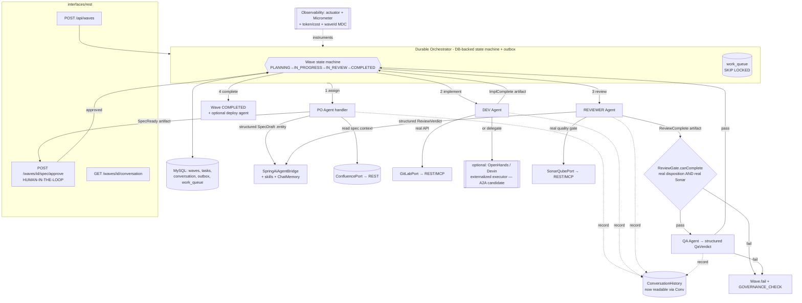

# `team` — Architecture Analysis, Multi-Agent SDLC Research & A2A Evaluation

> Senior-architect review of the `com.agile.team` Spring Boot + Spring AI project, benchmarked against how the industry builds multi-agent SDLC systems, with a go/no-go recommendation on Google's Agent2Agent (A2A) protocol.
>
> Part 1 is grounded entirely in the code as it exists on disk (July 2026). Parts 2–3 are grounded in sourced external research (cited inline). Where the code and the aspirational `CLAUDE.md` disagree, the code wins.

---

## 1. Current State Summary

### 1.1 What `team` actually does today

`team` is a Spring Boot 4.1 / Spring AI 2.0 application intended to run an autonomous "agile team" of four role agents (PO, DEV, REVIEWER, QA) through an event-driven pipeline that turns a Confluence page into a spec → code → review → QA → completed **Wave**.

**What runs end-to-end today is a single agent.** The pipeline is *designed* as a five-stage relay, but four of the five stages are commented out in source. Concretely, a `POST /api/waves` call does this and then stops:

1. `WaveController.startWave()` → `StartWaveUseCase.execute()` → `Orchestrator.startWave()` creates a `Wave` (status `PLANNING`), a `ConversationHistory`, finds the seeded PO `Agent`, and publishes an in-JVM `AgentTaskAssignedEvent`.
2. `PoAgentHandler.handleTaskAssigned()` (`@Async @EventListener`) searches Confluence via `ConfluenceRestClient`, builds a prompt, calls Claude via `SpringAiAgentBridge`, and stores the raw LLM response as a `Specification` on the wave.
3. The handler then **deliberately dead-ends**: Jira creation is commented out, and the `SpecificationReadyEvent` publish is commented out with `// TODO: re-enable once PO Agent output is validated`. It logs *"Pipeline stopped here — awaiting manual validation."*

Everything downstream — `DevAgentHandler`, `ReviewerAgentHandler`, `QaAgentHandler`, and the `Orchestrator.handleReviewComplete/handleQaComplete` listeners — has its entire body commented out. So `DEV`, `REVIEWER`, and `QA` agents never execute, no MR is created, no review happens, and **no wave ever leaves `PLANNING`**. The `Wave` state machine (`startExecution → moveToReview → complete`) is never invoked by the running system; it exists and is unit-tested but is dead at runtime.

### 1.2 How Spring AI is wired

| Concern | Where | Notes |
|---|---|---|
| Model | `application.yaml` → `spring.ai.anthropic.chat.options.model: claude-sonnet-5`, `max-tokens: 8192` | Single model for all roles. |
| Chat entry point | `SpringAiAgentBridge` | Two `ChatClient`s: one with `.defaultTools(confluenceTools)`, one plain. `chat()` **always** routes to `chatWithTools()` to dodge a `claude-sonnet-5` empty-response-under-extended-thinking behavior (documented in a code comment). |
| Tools (function calling) | `ConfluenceTools` (`@Tool searchConfluencePages`) | The only real Spring AI tool. Lives in the `application` layer. |
| Prompts | Inline `StringBuilder`/`String.format` in each handler + `buildSystemPrompt()` switch in `SpringAiAgentBridge` | No externalized/versioned templates, no `PromptTemplate` resources. |
| Skills (a lightweight RAG-ish system prompt augmentation) | `SkillRegistryAdapter` reads `skills/*/SKILL.md` frontmatter; `SpringAiAgentBridge.resolveSkillContext()` injects them | **Built but never called** — `resolveSkillContext()` is private and unused; `buildSystemPrompt()` does not call it. Skills are effectively inert at runtime. |
| Memory / RAG | none | No `ChatMemory`, no vector store, no retrieval. `ConversationHistory` is persisted but never read back into any prompt. |
| MCP | `spring-ai-starter-mcp-client`; `application.yaml` → `spring.ai.mcp.client.enabled: false` | MCP is **disabled**. Jira/GitLab/SonarQube MCP servers are configured but not started. |

### 1.3 Agent design & inter-agent communication (as-is)

- **Agents are data rows, not autonomous processes.** `Agent` is a JPA-backed domain entity seeded by `V1.1.0__seed_agents.sql` (one per role). "Being an agent" means a handler looks up the row by `AgentRole` and calls the shared `SpringAiAgentBridge` with a role-specific system prompt.
- **Communication is intended to be Spring `ApplicationEvent` message-passing** (`AgentTaskAssignedEvent` → `SpecificationReadyEvent` → `ImplementationCompleteEvent` → `ReviewCompleteEvent` → `QaCompleteEvent`), each consumed by an `@Async @EventListener`. This is an in-process event bus — no durability, no cross-JVM delivery.
- **In reality only the first event fires.** There is no live handoff between agents today because the chain is severed after PO.
- **No shared working memory.** Agents don't read each other's outputs except via the `Wave`/`ConversationHistory` aggregates, and `ConversationHistory` is write-only (never queried by any handler or exposed by any controller).

### 1.4 Architecture diagram (as-is)

```mermaid
flowchart TD
    C[POST /api/waves\nWaveController] --> UC[StartWaveUseCase]
    UC --> O[Orchestrator.startWave]
    O -->|save Wave PLANNING| DB[(MySQL)]
    O -->|publish| E1{{AgentTaskAssignedEvent}}
    E1 -->|@Async| PO[PoAgentHandler]
    PO -->|searchPages| CONF[ConfluenceRestClient REST]
    PO -->|chatWithTools| BR[SpringAiAgentBridge]
    BR --> ANTH[[Claude claude-sonnet-5]]
    PO -->|addSpecification, save| DB
    PO -.->|record| CH[(ConversationHistory\nwrite-only)]
    PO -.->|"SpecificationReadyEvent\n(COMMENTED OUT)"| X1[ DEAD END ]

    subgraph DISABLED [entire downstream pipeline commented out]
      direction TB
      DEV[DevAgentHandler]:::off --> REV[ReviewerAgentHandler]:::off --> QA[QaAgentHandler]:::off --> OC[Orchestrator.complete]:::off
    end
    X1 -.-> DISABLED

    subgraph PROMPTPRAY [MCP disabled - unused prompt-only adapters]
      GL[GitLabAdapter]:::off
      JI[JiraAdapter]:::off
      SQ[SonarQubeAdapter]:::off
    end

    classDef off fill:#eee,stroke:#999,stroke-dasharray:5 5,color:#777;
```

---

## 2. Limitations Found (itemized, code-grounded)

Ordered roughly by severity. Each item: **what's wrong · why it matters · where.**

### L1 — The multi-agent pipeline is disabled; the system is single-agent in practice
- **What:** `DevAgentHandler.handleSpecificationReady`, `ReviewerAgentHandler.handleImplementationComplete`, `QaAgentHandler.handleReviewComplete`, and `Orchestrator.handleReviewComplete/handleQaComplete` have their entire bodies commented out. `PoAgentHandler` never publishes `SpecificationReadyEvent` (also commented). The `@EventListener` annotations on the Orchestrator methods are commented too, so they aren't even registered.
- **Why it matters:** The headline capability — a collaborating agent team — does not exist at runtime. A wave is created and permanently stuck in `PLANNING`. `Wave.startExecution/moveToReview/complete` are never called outside tests.
- **Where:** `application/handler/DevAgentHandler.java:50-112`, `ReviewerAgentHandler.java:45-95`, `QaAgentHandler.java:39-98`, `application/orchestrator/Orchestrator.java:67-106`, `PoAgentHandler.java:141-147`.

### L2 — Committed secret: a live Anthropic API key is hardcoded in `application.yaml`
- **What:** `spring.ai.anthropic.api-key` defaults to a full `sk-ant-api03-…` key literal.
- **Why it matters:** Secret leakage. Anyone with repo access has a usable key (cost + abuse exposure). This is the single most urgent fix. (The repo is not currently a git repo — no `.git` — but the moment it is initialized/pushed, the key is in history.)
- **Where:** `src/main/resources/application.yaml:37`. Also DB creds `root/root` at lines 23-24.

### L3 — External "MCP" adapters are prompt-and-pray, and MCP is turned off anyway
- **What:** `GitLabAdapter`, `JiraAdapter`, `SonarQubeAdapter` don't call any API or MCP tool. They send a natural-language instruction to a `ChatClient` (e.g. *"Create a GitLab branch 'x' from 'main'"*) and treat the free-text reply as the result. Meanwhile `spring.ai.mcp.client.enabled: false`, so even the tool-calling path that could make this real is disabled — the LLM has no tools and will simply hallucinate a plausible answer.
- **Why it matters:** If the pipeline were re-enabled, DEV/REVIEWER/QA would operate on fabricated MR IDs, fabricated Sonar scores, and fabricated merge confirmations. There is no actual integration with GitLab/Jira/SonarQube. This is functionally non-working *and* silently wrong.
- **Where:** `infrastructure/adapter/mcp/GitLabAdapter.java`, `JiraAdapter.java`, `SonarQubeAdapter.java`; `application.yaml:44`.

### L4 — Control-flow decisions are made by substring-matching LLM prose
- **What:** Approval = `aiResponse.toLowerCase().contains("approved")` (`ReviewerAgentHandler`); QA pass = `contains("passed") || contains("accepted")` (`QaAgentHandler`); Sonar pass = `contains("passed") || contains("true")` and `extractScore()` grabs the first 0–100 number it finds (`SonarQubeAdapter`).
- **Why it matters:** Extremely brittle and easily inverted (e.g. *"changes are needed before this can be approved"* → matches `approved`). Governance outcomes hinge on accidental token presence. No structured output, no schema, no validation.
- **Where:** `ReviewerAgentHandler.java:69-72`, `QaAgentHandler.java:81-82`, `SonarQubeAdapter.java:32-33,56-72`.

### L5 — The governance gate is real in the domain but bypassed by the (future) reviewer wiring
- **What:** `ReviewGate.canComplete()` correctly requires `reviewDisposition.isApproved() && qualityScore.passed()` and is well unit-tested (`ReviewGateTest`, `WaveTest`). But the reviewer handler hardcodes `CodeQualityScore qualityScore = CodeQualityScore.passing(80)` "since we don't want to block on unavailable SonarQube," and derives approval from L4's substring match.
- **Why it matters:** The much-advertised "non-negotiable, no-bypass" gate becomes theater the moment the code is re-enabled: quality is always 80/pass, approval is a coin flip on prose. The invariant is sound; the inputs feeding it are fabricated.
- **Where:** `ReviewerAgentHandler.java:74-77`; gate logic (correct) `domain/review/ReviewGate.java`.

### L6 — PO output is stored raw and unvalidated despite a strict JSON contract
- **What:** The PO prompt demands *"valid JSON only … exactly three fields summary/description/acceptanceCriteria."* The handler never parses or validates it — it stores `llmResponse` verbatim as `Specification.content` and passes `List.of()` for acceptance criteria.
- **Why it matters:** No guarantee the "spec" is well-formed; the structured acceptance criteria the QA agent is supposed to check are thrown away. Spring AI's `.entity(Class)` structured-output binding exists for exactly this and is unused.
- **Where:** `PoAgentHandler.java:110-118`.

### L7 — No durability of pipeline state; orchestration is in-memory events
- **What:** Handoffs use `ApplicationEventPublisher` + `@Async` in-JVM. Domain events are not persisted; there is no outbox, no queue, no saga/retry. `Wave`/`Task`/`ConversationHistory` are persisted, but the *in-flight* pipeline position is not.
- **Why it matters:** A restart mid-wave loses all in-progress work with no recovery. Cannot scale horizontally (a second instance won't see another's events). No at-least-once delivery, no idempotency keys, no dead-letter.
- **Where:** `Orchestrator.java:57`, all `@Async @EventListener` handlers, `AsyncConfiguration.java`.

### L8 — `ConversationHistory` is write-only; there is no agent memory and no way to inspect a run
- **What:** Handlers `record(...)` messages, but nothing ever calls `getMessages()` at runtime, no controller exposes conversations, and no handler feeds prior messages into the next agent's prompt. `MessageType` values (`REVIEW_COMPLETE`, `GOVERNANCE_CHECK`, etc.) are only produced by the disabled code.
- **Why it matters:** The "audit trail / traceability" design goal isn't observable — you can't see what agents said. And agents have zero shared context: each call is stateless, so DEV can't see PO's reasoning beyond the stored spec blob.
- **Where:** `domain/conversation/ConversationHistory.java` (no reader), `interfaces/rest/*` (no endpoint), all handlers.

### L9 — Near-zero test coverage of behavior; the one integration test is fragile
- **What:** Tests cover domain value objects (`WaveTest`, `ReviewGateTest`, `AgentTest`, `ConversationHistoryTest`, `AgentMessageTest`) and `SkillRegistryAdapterTest` + `SkillGovernanceUseCaseTest`. There are **no** tests for any handler, the orchestrator, any adapter, `SpringAiAgentBridge`, or the controllers. `TeamApplicationTests.contextLoads` is a full `@SpringBootTest` that will attempt to connect to a real MySQL on `localhost:3306` (Testcontainers is a dependency but this test doesn't use it).
- **Why it matters:** The parts most likely to break (async event flow, prompt/response handling, gate wiring) are untested; the only wiring test needs external infra to pass, so CI can't run green out of the box.
- **Where:** `src/test/java/...` (domain-only), `TeamApplicationTests.java`.

### L10 — No observability, health, or cost/latency tracing
- **What:** No `spring-boot-starter-actuator`, no Micrometer, no Spring AI Observability, no MDC propagation across the `@Async` boundary (correlation ID / wave ID is lost between threads), no token/cost logging.
- **Why it matters:** LLM systems fail probabilistically and cost real money per call. Without per-wave tracing, token accounting, and health checks, you cannot debug a stuck wave or budget spend. The `@Async` thread hop means logs from PO can't be correlated to the triggering request.
- **Where:** absent from `pom.xml`; `AsyncConfiguration.java` (no `TaskDecorator` for MDC).

### L11 — No deployment or CI artifacts for the app
- **What:** There is no application `Dockerfile`, no `.github/workflows/`, no pipeline. The only Docker assets are `docker/mcp-inspector` and `docker/mcp-atlassian-inspector` (dev tooling). `.github/` contains only `CODEOWNERS`.
- **Why it matters:** "Deployed by autonomous agents" but the app itself has no reproducible build/deploy path or automated test/lint gate.
- **Where:** repo root (no Dockerfile), `.github/` (no workflows).

### L12 — Hexagonal boundaries leak: AI concerns bleed into `domain`-facing ports and `application`
- **What:** The `mcp` adapters implement domain ports (`GitLabPort`, etc.) *by delegating to an LLM `ChatClient`* — an AI orchestration concern masquerading as a deterministic API adapter. `ConfluenceTools` (`@Tool`, a Spring AI annotation) sits in `application/tool`, importing framework types into the use-case layer.
- **Why it matters:** Ports are supposed to be deterministic seams; making them LLM calls means the "adapter" can hallucinate, breaking the assumption every caller makes. The layering that DDD/hexagonal is meant to protect is quietly violated.
- **Where:** `infrastructure/adapter/mcp/*Adapter.java`, `application/tool/ConfluenceTools.java`.

### L13 — Hardcoded, single-tenant context
- **What:** `CONFLUENCE_SPACE_KEY = "EPE"` (`PoAgentHandler`, `ConfluenceTools`), target project `epe-rating-ftth-passive` hardcoded in DEV/REVIEWER prompts, Jira project `"SCA"` hardcoded, default language `"French"`.
- **Why it matters:** The "team" can only ever work on one Confluence space / one GitLab project. Not parameterized per wave, so it's a bespoke script, not a reusable platform.
- **Where:** `PoAgentHandler.java:33`, `ConfluenceTools.java:19`, `DevAgentHandler.java:71-73`, `PoAgentHandler.java:123`.

### L14 — No human-in-the-loop resume path, despite explicitly pausing for humans
- **What:** PO logs *"awaiting manual validation"* but there is no endpoint to approve a spec, edit it, or resume the pipeline. The only way forward is to uncomment code and redeploy.
- **Why it matters:** The one intentional human checkpoint has no mechanism, so the system can't actually be operated in its current "validation phase" mode.
- **Where:** `PoAgentHandler.java:147`; no corresponding controller action.

### L15 — Minor correctness/config smells
- `SpringAiAgentBridge.chat()` funnels everything through the tools client to work around `claude-sonnet-5` returning empty text under extended thinking — a model/option misconfiguration papered over in code (`SpringAiAgentBridge.java:39-44`). Extended thinking should be configured explicitly, not suppressed by side effect.
- `application.yaml` sets `spring.jpa.open-in-view: false` but the captured `startup.log` shows the OSIV warning and an explicit `MariaDBDialect` that Hibernate says is unnecessary — the log predates the yaml, i.e. config drift between what's committed and what was last run.
- `@Async` methods use no executor qualifier; they rely on the single `agentTaskExecutor` bean being picked up implicitly. Works today, but a second `Executor` bean would silently change scheduling.
- `spring-boot-devtools` is a runtime dependency — fine locally, should be excluded from prod images.

---

## 3. Improvement Plan (prioritized, actionable)

### P0 — Stop the bleeding (hours)
1. **Rotate and externalize the Anthropic key (L2).** Revoke the committed key immediately. Remove the literal from `application.yaml`; require `ANTHROPIC_API_KEY` from env (no default). Do the same for DB creds. Add a secrets scanner pre-commit hook before the repo is ever `git init`-ed/pushed. *Owner effort: <1h, highest ROI.*
2. **Make `contextLoads` runnable in CI (L9).** Either annotate `TeamApplicationTests` with a Testcontainers MySQL (`@Testcontainers` + `@ServiceConnection`) or split web/persistence slices so the smoke test doesn't need a hand-run DB.

### P1 — Make the pipeline actually run and be trustworthy (days)
3. **Re-enable the pipeline behind real integrations, not prose parsing (L1, L3, L4).**
   - Replace `GitLabAdapter/JiraAdapter/SonarQubeAdapter` with **deterministic REST clients** (mirror the clean `ConfluenceRestClient` pattern) OR enable MCP (`spring.ai.mcp.client.enabled: true`) and call MCP tools explicitly — but do not implement a domain port as a free-text `ChatClient` prompt.
   - Turn `spring.ai.mcp.client.enabled` on only once you've decided which of the two above you're using; today it's off, so tool calls can't happen.
4. **Use Spring AI structured output everywhere a decision is made (L4, L6).** Define records (`SpecDraft`, `ReviewVerdict{disposition, findings[], score}`, `QaVerdict{passed, reasons[]}`) and bind with `.entity(SpecDraft.class)`. Delete every `contains("approved"/"passed")`. Validate PO JSON and populate real `acceptanceCriteria`.
5. **Feed real SonarQube data into the gate (L5).** Remove the hardcoded `passing(80)`. If Sonar is unavailable, the gate should *fail closed* or explicitly mark `UNKNOWN`, never silently pass.

### P2 — Durability, memory, observability (1–2 weeks)
6. **Replace the in-JVM event bus with durable orchestration (L7).** Two realistic options given the stack:
   - *Lighter:* a **transactional outbox** table + a polling dispatcher, keeping Spring events but persisting each stage so restarts resume. Add idempotency keys per (waveId, stage).
   - *Heavier / recommended if you want horizontal scale:* model the wave as an explicit **state machine driving a work queue** (DB-backed, `FOR UPDATE SKIP LOCKED`), which also gives you multi-instance safety. This is a natural fit if you later adopt a graph orchestrator (see §6).
7. **Make `ConversationHistory` first-class (L8).** Add `GET /api/waves/{id}/conversation`. Feed prior messages / the spec into each downstream agent's prompt (or adopt Spring AI `ChatMemory`) so agents actually share context instead of restarting cold.
8. **Add observability (L10).** Add actuator + Micrometer + Spring AI observation; log tokens/cost per call; propagate a `waveId`/`correlationId` via a `TaskDecorator` on `agentTaskExecutor` so async logs correlate. This is the prerequisite for debugging anything probabilistic.
9. **Human-in-the-loop resume (L14).** Add `POST /api/waves/{id}/specifications/{sid}/approve` (and reject/edit) that publishes `SpecificationReadyEvent`. This makes the current "validation phase" an actual operating mode instead of a code-comment.

### P3 — Structure & reuse (ongoing)
10. **Fix layering (L12):** move `@Tool` tool classes to `infrastructure/adapter/ai`; keep `application` framework-light. Don't back domain ports with LLM calls.
11. **Parameterize context per wave (L13):** promote space key, GitLab project, Jira project, language to `StartWaveRequest`/wave config.
12. **Externalize prompts (L15):** move inline prompt strings to versioned resource templates (`classpath:/prompts/*.st`) so they're diff-able and testable; wire skills in (`resolveSkillContext` is already written — call it from `buildSystemPrompt`).
13. **Add a Dockerfile + CI (L11):** multi-stage build, exclude devtools, and a GitHub Actions workflow running `mvn verify` with Testcontainers.
14. **Configure extended thinking explicitly (L15)** instead of suppressing it by always attaching tools.

---

## 4. Competitive Benchmark

How `team`'s ambition (spec → code → review → QA, minimal human intervention) compares to what exists in mid-2026. Two categories: **end-to-end SDLC agent products** and **orchestration frameworks** you'd build on.

### 4.1 End-to-end SDLC agent products

| Product | What it does well | What it doesn't / limits | Maturity (mid-2026) | Relevance to `team` |
|---|---|---|---|---|
| **Devin (Cognition AI)** | Highest-autonomy commercial "AI software engineer"; plans, edits multi-file, runs tests, opens PRs. Enterprise pilots at scale (Goldman Sachs piloting alongside 12,000 devs, framed as a "hybrid workforce"). [ZenML](https://www.zenml.io/llmops-database/autonomous-software-development-agent-for-production-code-generation), [AIToolRanked](https://aitoolranked.com/blog/devin-ai-review) | Closed/hosted; success on real, messy codebases well below the "fully autonomous" marketing; costly; not a framework you compose your own roles on. | Commercial GA, real pilots | This is the **DEV agent** `team` is hand-rolling. Devin ≈ `team`'s DEV+REVIEWER done properly. |
| **OpenHands (ex-OpenDevin)** | Open-source (MIT), fully autonomous CodeAct loop with terminal/browser/file tools; deployable in CI/CD triggered by issue labels, no human in loop. [toolhalla](https://toolhalla.ai/blog/devin-vs-openhands-vs-swe-agent-2026), [DEV](https://dev.to/sonotommy/8-ai-coding-agents-that-actually-ship-production-code-in-2026-18ch) | Autonomy ≠ reliability: current agents score ~20–45% on SWE-bench Verified; practical success ~60–80% only on well-scoped tasks with clear requirements. Needs sandboxing/guardrails. | Mature OSS, production users | Closest **open** analogue to the DEV role; `team` could delegate implementation to OpenHands instead of a raw prompt. |
| **GitHub Copilot coding agent / Workspace** | Issue-to-PR generation with the deepest ecosystem/repo integration; strong review-in-the-loop ergonomics. [DEV](https://dev.to/sonotommy/8-ai-coding-agents-that-actually-ship-production-code-in-2026-18ch) | Tied to GitHub; assistive rather than a multi-role autonomous "team"; less control over custom role/gate logic. | Commercial GA | `team` targets GitLab, so this is a reference model, not a drop-in. |
| **Factory.ai ("Droids")** | Role-specialized "droids" spanning coding/review/knowledge tasks across the SDLC — conceptually the closest to a *team of agents per role*. [agentic.ai](https://agentic.ai/best/coding-agents) | Commercial/hosted; opinionated; you don't own the orchestration or governance semantics. | Commercial, growing | Same north star as `team` (per-role agents), but proprietary — a benchmark, not a base. |
| **MetaGPT / ChatDev (research)** | Explicitly assign SDLC roles (PM, architect, engineer, QA) to agents with an SOP-driven waterfall; produce structured artifacts. MetaGPT's "software company" simulation yields more structured code. [TowardsAI](https://pub.towardsai.net/langgraph-vs-crewai-vs-autogen-which-ai-agent-framework-should-your-enterprise-use-in-2026-3a9ebb407b09) | Research-grade; great on greenfield toy projects, fragile on large existing repos; limited production hardening/governance/observability. | Research / early | This is *architecturally what `team` is imitating* (role-per-agent SDLC). Validates the idea; warns that the hard part is production reliability, not the role decomposition. |

### 4.2 Orchestration frameworks (what you'd build the plumbing on)

| Framework | Model | Strengths | Tradeoffs | Fit for `team` |
|---|---|---|---|---|
| **LangGraph** | Stateful directed (cyclic) graph; explicit state, branching, checkpoints. [TowardsAI](https://pub.towardsai.net/langgraph-vs-crewai-vs-autogen-which-ai-agent-framework-should-your-enterprise-use-in-2026-3a9ebb407b09), [presenc.ai](https://presenc.ai/research/multi-agent-orchestration-frameworks-2026) | Largest production footprint; durable state/checkpointing solves exactly `team`'s L7; fine-grained control. | Python-centric; more boilerplate; would sit beside the JVM app as a service. | Best conceptual template for the durable state machine `team` needs (§3 item 6). |
| **CrewAI** | Role/goal/backstory "crew" that passes outputs between roles, delegates. [openagents](https://openagents.org/blog/posts/2026-02-23-open-source-ai-agent-frameworks-compared) | Fastest way to express "PO→DEV→REVIEWER→QA"; maps 1:1 to `team`'s mental model. | Less production discipline than LangGraph; Python. | Mirrors `team`'s role design; good reference for prompts/handoffs. |
| **AutoGen / AG2** | Conversational agent teams; `GroupChat` with a selector deciding who speaks next. [presenc.ai](https://presenc.ai/research/multi-agent-orchestration-frameworks-2026) | Flexible multi-agent dialogue; good for exploratory collaboration. | Conversation-as-control-flow is hard to make deterministic/governed. | Less aligned — `team` wants a governed pipeline, not open dialogue. |

**Takeaway:** `team`'s *design* (role-per-agent SDLC pipeline with a governance gate) is squarely in line with MetaGPT/CrewAI/Factory.ai. Where it lags the field is exactly the boring production layer the leaders invested in: **real tool integration, durable state, structured decisions, observability, and sandboxed execution**. The unique, defensible piece `team` has is the explicit, auditable **`ReviewGate` + skills-governance + `CODEOWNERS`** concept — that's genuinely differentiated and worth keeping; it just needs real inputs.

---

## 5. A2A Recommendation

### 5.1 What A2A is
Google's **Agent2Agent (A2A)** — now a Linux Foundation project — is the **agent-to-agent coordination layer**: how independent agents *discover* each other (via **Agent Cards**, a published capability descriptor), *delegate* work, exchange messages, stream status, and return artifacts across a **task lifecycle**, over a web-aligned (HTTP/JSON-RPC) transport. It is complementary to **MCP**, which is the **agent-to-tool** layer. The consensus framing in 2026: *MCP connects an agent to tools/data; A2A connects agents to each other.* ([onereach](https://onereach.ai/blog/guide-choosing-mcp-vs-a2a-protocols/), [atlan](https://atlan.com/know/google-a2a-protocol/), [auth0](https://auth0.com/blog/mcp-vs-a2a/))

### 5.2 Maturity (mid-2026)
- **Spec is production-ready:** v1.0 shipped early 2026 with SDKs in ~5 languages, Signed Agent Cards (cryptographic identity), multi-tenancy, and load-balancer-friendly design. ([glukhov.org](https://www.glukhov.org/ai-systems/comparisons/a2a-protocol-2026-adoption/), Linux Foundation)
- **Adoption is real but shallow relative to MCP:** 150+ supporting organizations and production deployments claimed across supply chain, finance, insurance, IT ops — but the Linux Foundation announcement gave **no deployment counts or usage metrics**, and critics note the adoption is thin next to MCP's *thousands* of public servers and tool-level ecosystem (Claude Desktop, Cursor, Windsurf). ([Linux Foundation press](https://www.linuxfoundation.org/press/a2a-protocol-surpasses-150-organizations-lands-in-major-cloud-platforms-and-sees-enterprise-production-use-in-first-year), [agentndx](https://agentndx.ai/blog/a2a-protocol-adoption-mid-2026/))
- **Known gaps:** agent **discovery** is still largely manual without an Agent Name Service, so A2A tends to stay "locked inside enterprises where teams already know which agents exist"; and combining MCP + A2A **expands the attack surface multiplicatively** (capability misrepresentation, over-broad delegation, context exfiltration by a compromised agent). ([agentndx](https://agentndx.ai/blog/a2a-protocol-adoption-mid-2026/), [arxiv Agentverse gap analysis](https://arxiv.org/pdf/2606.20570))

### 5.3 Verdict: **No-go now — but MCP-first, A2A-ready.**

**Reasoning, specific to this codebase:**

1. **A2A solves a problem `team` doesn't have yet.** A2A shines when agents are **separately owned/deployed services that must discover and negotiate across boundaries** (often across orgs). `team`'s four agents are four `@EventListener` methods in one Spring context sharing one database. Introducing A2A here would replace an in-process method call with an HTTP task-lifecycle handshake between components that already share memory — pure overhead, no benefit. The industry guidance is explicit: *start with MCP; add A2A only when the problem demands cross-agent, cross-boundary coordination.* ([onereach](https://onereach.ai/blog/guide-choosing-mcp-vs-a2a-protocols/), [pickaxe](https://pickaxe.co/post/mcp-vs-a2a-protocol))
2. **`team`'s actual bottleneck is the tool layer (L3), which is MCP's domain, not A2A's.** The DEV/REVIEWER/QA agents fail because they don't really talk to GitLab/Jira/SonarQube — that's an **agent-to-tool** gap. MCP (already a dependency, currently `enabled: false`) or plain REST clients fix it. A2A does nothing for it.
3. **A2A adds security surface `team` is not ready to defend (no authn/z, no monitoring, committed secrets — see L2, L10).** Layering an inter-agent trust protocol onto a system with a hardcoded key and no observability is premature.
4. **The real orchestration need is *durability and state* (L7), which A2A doesn't provide.** A2A standardizes the *wire format* of a task handoff; it doesn't give you the transactional outbox / checkpointed state machine `team` is missing. LangGraph-style durable orchestration (or the DB-queue in §3.6) is the right tool.

**Suggested adoption path (if/when it becomes justified):**

- **Now:** Fix the tool layer with **MCP** (flip `spring.ai.mcp.client.enabled: true` and call tools explicitly) or deterministic REST clients. Keep agents in-process behind the durable state machine from §3.6. Get structured outputs, gate inputs, and observability real.
- **Later trigger for A2A:** adopt it **only** when at least one of these is true — (a) you split an agent (e.g. a heavyweight DEV/OpenHands executor) into its **own deployable service**; (b) you need to **interoperate with agents you don't own** (another team's PO agent, a vendor QA agent); or (c) you want other systems to **discover and call** `team`'s agents.
- **When you do adopt:** expose each externalized agent with an **Agent Card**, keep **MCP for its tools and A2A for the handoffs** (the standard hybrid), and pair it with Signed Agent Cards + least-privilege delegation + full request logging to manage the expanded attack surface. Design the internal event contracts now (`SpecificationReadyEvent`, etc.) to map cleanly onto A2A task artifacts later, so the migration is a transport swap, not a redesign.

**One-line answer:** A2A is a sound *future* interoperability bet and the right standard to grow into, but it is the wrong *next* investment — `team` needs MCP/REST tool integration, durable orchestration, structured decisions, and observability first. Build MCP-first and A2A-ready.

---

## 6. Target Architecture

An end-state that is realistic *from the current codebase* — it keeps the DDD/hexagonal skeleton, the `Wave` state machine, the `ReviewGate`, and the skills-governance idea, and fixes the load-bearing gaps. No rewrite.

### 6.1 Principles
- **Keep the domain (`Wave`, `ReviewGate`, `Specification`, governance skills) — it's the good part.** Everything below is infrastructure/application change.
- **Deterministic seams for tools; LLM only for judgment.** Ports (`GitLabPort`, `SonarQubePort`, `JiraPort`) become real clients (REST or MCP), never LLM prompts.
- **Durable, resumable orchestration** replaces fire-and-forget events.
- **Structured, validated agent I/O** replaces substring parsing.
- **MCP-first, A2A-ready**: internal handoffs stay in-process now but are modeled as explicit task artifacts so they can become A2A tasks if an agent is later externalized.

### 6.2 Nominal spec-to-deployed-code flow (target)



### 6.3 Per-role agent shape (target)

Each role becomes a uniform unit: **`{ system prompt (+ governed skills) → structured input → deterministic tools via ports → structured verdict → durable artifact → state transition }`**.

| Role | Judgment (LLM) | Deterministic tools (ports) | Structured output | Emits |
|---|---|---|---|---|
| **PO** | draft spec + acceptance criteria from Confluence | `ConfluencePort` (REST ✓ done), later `JiraPort` (REST/MCP) to create the ticket | `SpecDraft{summary, description, acceptanceCriteria[]}` (validated) | `SpecificationReady` (→ human approve → `startExecution`) |
| **DEV** | plan implementation / write diff | `GitLabPort` (real) **or** delegate to an externalized executor (OpenHands/Devin) — the natural **A2A boundary** | `Implementation{branch, mrId, summary}` | `ImplementationComplete` (→ `moveToReview`) |
| **REVIEWER** | classify findings by severity vs `review-criteria` (governance skill) | `GitLabPort` (diff), `SonarQubePort` (real gate) | `ReviewVerdict{disposition, findings[], qualityScore}` | `ReviewComplete` → **`ReviewGate`** |
| **QA** | validate against `acceptanceCriteria` | — (reads spec + impl from `Wave`/`ConversationHistory`) | `QaVerdict{passed, reasons[]}` | `QaComplete` (→ `complete`/`fail`) |
| **(new) SRE/Deploy** *(optional, closes SDLC)* | decide deploy readiness | CI/CD or CF API port | `DeployVerdict{deployed, url}` | `WaveDeployed` |

### 6.4 Communication model (target)
- **Within one deployable:** the durable orchestrator drives transitions off a **DB-backed work queue + outbox**, so restarts resume and multiple instances coordinate safely (fixes L7). Handoffs carry **typed artifacts**, not prose.
- **Across deployables (only when justified):** if DEV is externalized to OpenHands/Devin, or another team's agent must participate, that single edge becomes an **A2A task** (Agent Card + task lifecycle), while each agent keeps using **MCP** for its own tools. The internal artifact types are designed to map onto A2A artifacts so this is a transport swap.
- **Memory:** downstream agents read prior `ConversationHistory` / spec context (or Spring AI `ChatMemory`), so the pipeline is genuinely collaborative rather than four cold calls (fixes L8).

### 6.5 What stays, what changes
- **Stays:** DDD/hexagonal package layout, `Wave` aggregate + state machine, `ReviewGate`, skills + `SkillGovernanceUseCase` + `CODEOWNERS` governance, `ConfluenceRestClient` (the model to copy).
- **Changes:** MCP/REST tool adapters (no more prompt-and-pray), structured outputs, durable orchestration, secrets out of source, observability, HITL resume endpoint, per-wave parameterization, and prompts/skills actually wired into `buildSystemPrompt`.

---

### Sources
- Linux Foundation — [A2A surpasses 150 organizations, enterprise production use](https://www.linuxfoundation.org/press/a2a-protocol-surpasses-150-organizations-lands-in-major-cloud-platforms-and-sees-enterprise-production-use-in-first-year)
- Rost Glukhov — [Google A2A Protocol in 2026: Adoption, Hype, and Reality](https://www.glukhov.org/ai-systems/comparisons/a2a-protocol-2026-adoption/)
- agentndx — [A2A Protocol Adoption: Where Things Stand in Mid-2026](https://agentndx.ai/blog/a2a-protocol-adoption-mid-2026/)
- OneReach — [Choosing MCP vs A2A](https://onereach.ai/blog/guide-choosing-mcp-vs-a2a-protocols/)
- Atlan — [Google A2A Protocol: How Agent-to-Agent Coordination Works](https://atlan.com/know/google-a2a-protocol/)
- Auth0 — [MCP vs A2A: AI Agent Communication Protocols](https://auth0.com/blog/mcp-vs-a2a/)
- Pickaxe — [MCP vs A2A Protocol Comparison (2026)](https://pickaxe.co/post/mcp-vs-a2a-protocol)
- arXiv 2606.20570 — [Infrastructure for the Agentic Web: Gap Analysis (Agentverse)](https://arxiv.org/pdf/2606.20570)
- TowardsAI — [LangGraph vs CrewAI vs AutoGen (2026)](https://pub.towardsai.net/langgraph-vs-crewai-vs-autogen-which-ai-agent-framework-should-your-enterprise-use-in-2026-3a9ebb407b09)
- presenc.ai — [Multi-Agent Orchestration Frameworks 2026](https://presenc.ai/research/multi-agent-orchestration-frameworks-2026)
- OpenAgents — [Open-source AI agent frameworks compared (2026)](https://openagents.org/blog/posts/2026-02-23-open-source-ai-agent-frameworks-compared)
- DEV — [8 AI Coding Agents That Actually Ship Production Code in 2026](https://dev.to/sonotommy/8-ai-coding-agents-that-actually-ship-production-code-in-2026-18ch)
- ZenML — [Devin: Autonomous Software Development Agent](https://www.zenml.io/llmops-database/autonomous-software-development-agent-for-production-code-generation)
- AIToolRanked — [Devin AI Review 2026](https://aitoolranked.com/blog/devin-ai-review)
- toolhalla — [Devin vs OpenHands vs SWE-agent (2026)](https://toolhalla.ai/blog/devin-vs-openhands-vs-swe-agent-2026)
- agentic.ai — [Best coding agents](https://agentic.ai/best/coding-agents)

*Analysis date: 2026-07-25. Part 1 reflects the source tree as committed; several capabilities described in `CLAUDE.md` are aspirational and not yet active in code (see §2).*
